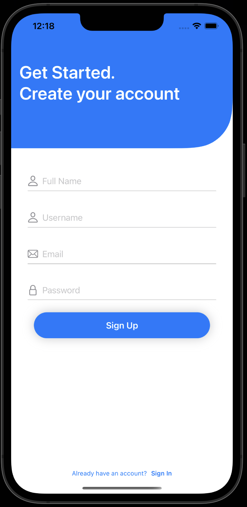
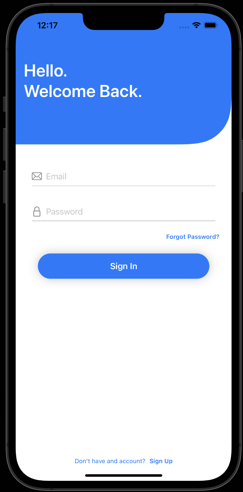

<!-- TABLE OF CONTENTS -->

  
Table of Contents

  <ol>
    <li><a href="#about-the-project">About The Project</a></li>
    <li><a href="#authorization">Authorization</a></li>
    <li><a href="#usage">Usage</a></li>
    <li><a href="#roadmap">Roadmap</a></li>
    <li><a href="#contributing">Contributing</a></li>
    <li><a href="#license">License</a></li>
    <li><a href="#contact">Contact</a></li>
    <li><a href="#acknowledgments">Acknowledgments</a></li>
  </ol>

<!-- ABOUT THE PROJECT -->
## About The Project

This project is a clone of Twitter I created to showcase my ability to code in Swift and use the Firebase api. The features of this app include: User Authorization, Creating and posting Tweets, Following other Users and seeing their posts, and Liking Posts. 

<!-- Authorization -->
## Authorization and User Profile

At this stage users can create accounts or login using Firebase's Auth library. Upon first account creation the user will select a profile picture before contiuing to the rest of the app. The user profile shows Tweets the user liked and allows them to either edit their profile or follow the profile depending on whether they are viewing their profile or someone elses. The UI is created with SwiftUI. Below is a demo of what that looks like.
 

<!-- Feed and posts -->
## Feed
The feed displays tweets of prople the user follows as shown. Data is fetched from firebase and displayed with the post module.

<!-- Search -->
## Search
In the search page users can search for other accounts.

(<a href="#readme-top">back to top</a>)

<!-- CONTACT -->
## Contact

Marcelo Monsalve - marcelohakanson6@gmail.com

(<a href="#readme-top">back to top</a>)

